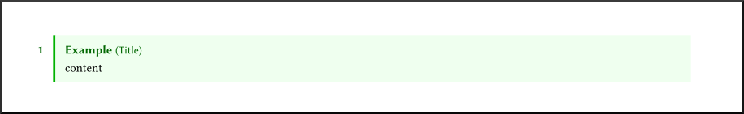
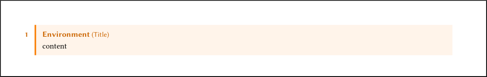

# chez-sty

This is a repository containing an up-to-date version of
my LaTeX classes and style files, which I use for almost all my documents.


Currently, only the document styles are functional.
The beamer style is extremely bare bones.

## Installation
There are two main use cases.
You can try out the document style for a single document,
or you can install the styles for usage in all documents.

### Single document
Clone the repository and copy all of the files into
the same directory as the `.tex` file being compiled.
The compiler should automatically detect the style files when compiling
the main `.tex` file.

### Global usage
It is also possible to install the styles globally
so that all documents have access to them.
To do this, clone this repository into
the corresponding location within the TEXMF root directory.
Compiler-dependent instructions are below.

#### TeXLive
Clone the repository into `~/texmf/tex/latex`,
so that the repository files are in `~/texmf/tex/latex/chez-sty`.
You may need to create intermediate directories.

For Windows, the repository to put the files in can be found by
opening Windows Powershell (in the Win-X menu), and running
`kpsewhich -var-value=TEXMFLOCAL` or
`kpsewhich -var-value=TEXMFHOME`.

You can also modify the environment variable `$TEXMFHOME`
to declare another location for the local TEXMF directory.
In that case, the repository should be cloned into `$TEXMFHOME/tex/latex`.

#### MacTeX
Clone the repository into `~/Library/texmf/tex/latex`,
so that the repository files are in `~/Library/texmf/tex/latex/chez-sty`.
You may need to create intermediate directories.

#### MiKTeX
Find the `UserInstall` directory corresponding to your system
[here](https://miktex.org/kb/texmf-roots).
Clone the repository into `<UserInstall>/tex/latex`,
so that the repository files are in `<UserInstall>/tex/latex/chez-sty`.
You may need to create intermediate directories.

For example, on Windows, the repository should be cloned to
`%USERPROFILE%\Roaming\MiKTeX\2.9\tex\latex\chez-sty`,
where `%USERPROFILE%` is probably something like `C:\Users\Jason`

You can also register an additional TEXMF root directory,
as described at the end of https://miktex.org/kb/texmf-roots.


## Usage
Use the documentclass `chezarticle` or the documentclass `chezreport`
in place of the standard `article` and `report` classes respectively.

Here is an example document:
```tex
\documentclass{chezreport}
\title{Sample document}

\begin{document}
\maketitle
This is some content.
\end{document}
```


### Features

#### Commands
There are many commands defined for convenience and code readability.
Notable ones are:
- `\vocab{text}` to bold and color text blue, to indicate an important term.

- `\ol{text}` and `\ul{text}` for overline and underline.

- `\FF`,
  `\NN`,
  `\ZZ`,
  `\QQ`,
  `\RR`,
  `\CC`, and
  `\HH`
  for `\mathbb` versions of the corresponding letter.

- `\intersect` and `\union` for code-readable versions of `\cap` and `\cup`  
  `\bigintersect` and `\bigunion` also exist for `\bigcap` and `\bigcup`.

- `\dv{y}{x}` gives the derivative fraction `\frac{dy}{dx}`.  
  `\ddv{y}{x}` gives the derivative fraction `\frac{d^2y}{dx^2}`.  
  `\dnv{y}{x}{n}` gives the derivative fraction `\frac{d^ny}{dx^n}`.

  Similarly
  `\pdv{y}{x}` gives the partial derivative fraction
    `\frac{\partial y}{\partial x}`.  
  `\pddv{y}{x}` gives the partial derivative fraction
    `\frac{\partial^2 y}{\partial x^2}`.  
  `\pdnv{y}{x}{n}` gives the partial derivative fraction
    `\frac{\partial^n y}{\partial x^n}`.

  There exists starred versions of all of these commands
  that produce inline versions.

#### Delimiters
In math mode, we often use `\left` and `\right` to get
correctly sized delimiters. 
There are typically two approaches people take when doing so:
- typing `\left(\right)`,
  typing in between the delimiters,
  and then moving the cursor to the end; and
- typing `\left(`,
  then the content in between the delimiters,
  and then `\right)`.

The first method is inconvenient as we have to move the cursor back and forth,
and the second method is error prone as we have to remember the `\right`,
which becomes increasingly easy to forget in the case of nested brackets

In this package we present a solution to this.
We define commands for each delimiter pair, e.g. `\parens*{content}`,
where the star indicates that the delimiters should be automatically sized.
Omitting the star will give the normal sized delimiters.
For manual sizing, you can use `\parens[\big]{content}`.

The delimiters provided are:
- `\braces`
- `\parens`
- `\brackets`
- `\angles`
- `\verts`
- `\Verts`
- `\floor`
- `\ceil`

There are also semantically-named delimiters to allow for more readable code:
- `\abs` (for `\verts`)
- `\size` (for `\verts`)
- `\norm` (for `\Verts`)
- `\tuple` (for `\angles`)
- `\gen` (for `\angles`; use in the context of generators)
- `\fgen` (for `\braces`; f here stands for free)
- `\set` (for `\braces`; this also smartly resizes a `\mid` inside the set)

#### Boxes
One main feature of the style is colored boxes environments
for definitions, examples, and theorems.
These can be used with, e.g.
```tex
\begin{example}[Title]<label>
  content
\end{example}
```


The `[Title]` or `<label>` arguments can be, and often are, omitted.
The label can be used like `\cref{ex:label}` or `\Cref{ex:label}`,
producing the text "example 1" or "Example 1" respectively.
The other prefixes (corresponding to `ex:`) are defined in `chez.sty`.

The environments for boxes provided are:
- `theorem`
- `lemma`
- `claim`
- `proposition`
- `corollary`
- `conjecture`
- `algorithm`
- `definition`
- `example`
- `fact`
- `note`

The starred version of each environment indicates a non-numbered environment.

##### Ad-hoc boxes

```tex
\begin{adhoctheorem}{Environment}[Title]
  content
\end{adhoctheorem}
```



## Package Options

There are many options that can be used in the documentclass, e.g.  
`\documentclass[nodate, serifs]{chezarticle}`.

- `nodate` removes the date from `\maketitle` while maintaining nice spacing.
- `serifs` changes the title and header fonts to have serifs.
- `headers` places a header on each page,
  customized with `\ihead`, `\chead`, and `\ohead`.  
  The `i`, `c` and `o` correspond to inner, center, and outer,
  where we interpret the page to be on the right side of a bound book
  (so that outer is on the right).
- `gray` makes the entire document grayscale.
  Useful for printing or previewing for print.
- `nobox` disables boxes.
  `adhoctheorem` is not supported if this option is turned on.
- `asy` enables [Asymptote](https://asymptote.sourceforge.io/) support.
- `algos` enables algorithm typesetting with the `algpseudocode` package.
- `code` enables code snippet typesetting with the `minted` package.  
  This has a dependency of [Pygments](https://pygments.org/),
  and requires the document to be compiled with the option `-shell-escape`
  (so that TeX can externally run Pygments).
- `compact` significantly reduces the spacing everywhere.
  Useful for *compact* note sheets.
- `nomarginnum` disables section numbers and box environment numbers from
  appearing in the left margin.
- `sepcounters` causes the problem, question, exercise, and remarks
  to use a different counter from the other boxed environments.


## Internals

- `chezbase.sty` contains the commands and basic packages that are intended
  to be used everywhere, both beamer presentations and documents.
  This should not be loaded directly.
- `chez.sty` contains the page setup and setup for environments
  in document-type TeX files.
- `chezb.sty` contains the page setup and setup for environments
  in beamer-type TeX files. This is currently not functional.
- `chezglyphtounicode.tex` is a file containing mappings
  that allows selected text to have the correct characters.
- `chezint.sty` is a wrapper around the `esint` font,
  giving multivariable integral symbols,
  while not modifying the existing integral symbols,
  which the `esint` package modifies for some reason.
  
The class files are simple wrappers around these internal files
- `chezarticle.cls` defines the documentclass corresponding to `article`.
- `chezreport.cls` defines the documentclass corresponding to `report`.


## Contributing
If something is missing, feel free to fork and make a change yourself.
Since these are my personal styles,
I probably will accept few pull requests,
and only those that I can see myself using.

Big thanks to Daniel Zhu for helping with the code for the boxed environments.
